# TAREA 1 - SECCION 3 - EJERCICIOS PRACTICOS DDL Y DML

## Indice
- [Creando esquema y tablas e insertando datos](#creando-esquema-y-tablas-e-insertando-datos)
	- [BD World](#bd-world)
	  - [Creando world](#creando-tabla-world)
	  - [Metiendo datos](#metiendo-datos)
	- [BD Nobel](#bd-nobel)
	  - [Creando world](#creando-tabla-nobel)
	  - [Metiendo datos](#metiendo-datos-nobel)
	- [BD goal](#bd-goal)
		- [Creando la BD](#creando-la-bd)
		- [Codigo final](#codigo-final)
		- [Introducir Datos](#introducir-datos)
	- [BD movies](#bd-movies)
		- [Creando BD Movies](#crear-bd-movies)
- [Borrando esquema y tablas](#borrando-esquema-y-tablas)
- [Adición y borrado de columnas](#adicion-y-borrado-de-columnas)
- [Adición y borrado de restricciones](#adicion-y-borrado-de-restricciones)
- [Modificación y Borrado de tuplas](#modificacion-y-borrado-de-tuplas)
- [Ejercicio 1](#ejercicio-1-proyectos-de-investigacion)
- [Ejercicio 2](#ejercicio-2-naves-espaciales)
 
-----------------------------------------------
# Creando esquema y tablas e insertando datos
Para empezar a probar las instrucciones CREATE e INSERT voy a recrear las BDs de SQLZOO (world, nobel, goal y movie) y a introducirles datos.

## BD World
Vamos a intentar recrear esta tabla de SQLZOO y trabajar con ella.

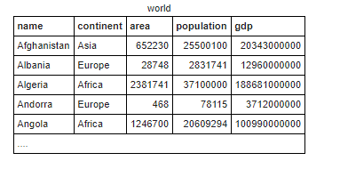

### Creando tabla world
Para crear la tabla world, es necesario utilizar la instrucción CREATE TABLE:
  > CREATE TABLE nombre tabla (campo1 tipo, campo2 tipo....);

Se toman las siguientes consideraciones:
  - El campo name será VARCHAR(40) y PK
  - El campo continent será VARCHAR(40)
  - Los campos population, gdp y area seran bigint
  
Por tanto, la instrucción para crear la tabla será la siguiente:

```SQL
  CREATE SCHEMA world;
  
  CREATE TABLE world.world(
    name VARCHAR(40) PRIMARY KEY,
    continent VARCHAR(40),
    area bigint,
    population bigint,
    gdp bigint
 );
```


Podríamos hacer un SELECT ahora de la misma tabla para ver si se ha creado correctamente, aunque evidentemente no devolvería ningun dato, ya que está vacía.

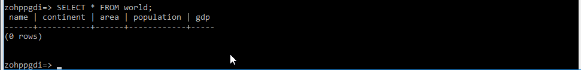


### Metiendo Datos
Para introducir datos en la tabla antes creada usamos la instrucción INSERT:
> INSERT INTO nombreTABLA [(orden de campos)] VALUES (valorcampo1, valorcampo2...);

Si bien el apartado de orden de campos se puede omitir, es útil para cuando no queremos introducir valores en todos los campos o lo queremos hacer en desorden, por la razón que sea. En ese caso, debemos tener cuidado de que el orden de los campos se correspondan con los valores introducidos al final.

Así pues, introducimos algunos valores de prueba directamente sacados de SQLZOO:

```SQL
INSERT INTO world.world VALUES('Afghanistan','Asia',652230,25500100,20343000000);
```

Podemos añadir múltiples tuplas en la misma sentencia, separando cada tupla con comas:

```SQL
INSERT INTO world.world VALUES('Albania','Europe',28748,2831741,12960000000),
                        ('Algeria','Africa',2381741,37100000,188681000000)
                        ('Andorra','Europe',468,78115,3712000000)
                        ;
```

Usando el orden de los campos, podríamos meter nombre y población, tomando el resto valores nulos:

```SQL
INSERT INTO world.world (name, population)
VALUES('Argentina',44270000);
```
A este punto tendríamos los siguientes datos:

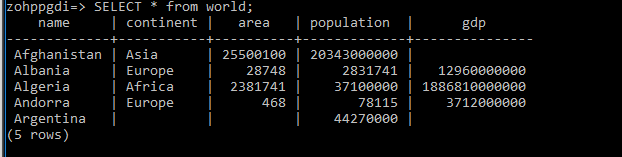

## BD nobel


### Creando tabla nobel
La tabla nobel tampoco cuenta con claves ajenas con lo cual es muy similar a la anterior. Sin embargo, podemos empezar a introducir algunas restricciones nuevas, como por ejemplo NOT NULL, la cual impide que el campo al que afecta pueda tomar el valor NULL en las inserciones de datos:

```SQL
    CREATE SCHEMA nobel;
    CREATE TABLE nobel.nobel(
      winner varchar(50) PRIMARY KEY,
      yr int NOT NULL,
      subject varchar(39) NOT NULL,
      CHECK (yr>1900 AND yr<=2020));
```

Así mismo, podemos optar por indicar que el año solo puede estar comprendido entre 1901 (Año de la primera entrega) y el año actual, ambos incluidos. Esto lo permite la CONSTRAINT CHECK, la cual nos permite espeficar el predicado que se ha de cumplir para que la inserción sea válida.

### Metiendo Datos Nobel
Introducimos los primeros datos en la tabla nobel, sin ningun tipo de problema:
```SQL
INSERT INTO nobel.nobel (yr,subject,winner) VALUES (1960,'Chemistry','Willard F. Libby'),
                                             (1960,'Literature','Saint-John Perse'),
                                             (1960,'Medicine','Sir Frank Macfarlane Burnet'),
                                             (1960,'Medicine','Peter Madawar');

```

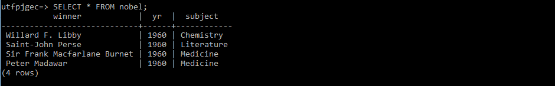

Ahora probemos las restricciones anteriores. En primer lugar, vamos a probar a poner un registro con año inválido:
```SQL
INSERT INTO nobel.nobel (yr,subject,winner) VALUES (2960,'Chemistry','Daniel Dipas');
```

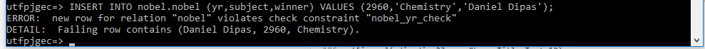 

Como se puede observar, no cumple con el CHECK del año, con lo cual el registro no se inserta en la tabla. Esto es perfecto para especificar normas sencillas que debe cumplir un dato para ser válido.

Lo mismo pasaría con campos NOT NULL si intentamos insertar valores nulos:
```SQL
INSERT INTO nobel.nobel (yr,winner) VALUES (2960,'Daniel Dipas');
```

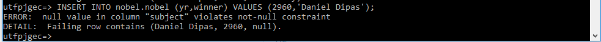

Este insert violaría la regla NOT NULL del campo subject, con lo cual no se permite su inserción:

## BD goal


La base de datos goal gana en complejidad por varios hechos:
	- En primer lugar, contamos con varias tablas relacionadas entre ellas, con lo cual tendremos que unirlas con FOREIGN KEY
	- Existe una dependencia en identificación: Solo queremos goles de los partidos existentes. Si borramos un partido, los goles del mismo se van fuera.
	- Por no utilizar todo borrados CASCADE, voy a jugar con valores por defecto en caso de que se borre un equipo.
	
### Creando la BD
En primer lugar empezamos definiendo el nuevo esquema y la primera tabla, que será eteam. Muy importante recordar lo siguiente:
	- Si pretendemos definir tablas y relaciones simultaneamente, deben introducirse primero las tablas que no tienen relación y posteriormente las siguientes de manera sucesiva.
	- Una alternativa a esto es definir todas las tablas sin relaciones al principio y, antes de introducir datos, añadir las restricciones y relaciones posteriormente. Esto es especialemente útil en caso de que existan tablas que se relacionen en los dos sentidos, dependiendo la una de la otra (No sería posible implementarlas con el primer método).
	
En este caso, voy a ir definiendo las tablas en orden de implementación, con las relaciones y restricciones incluidas en la propia definición:

```SQL
CREATE SCHEMA goal;

CREATE TABLE goal.eteam(
	id char(3) PRIMARY KEY,
	teamname nchar(30) NOT NULL,
	coach nchar(30) NOT NULL,
	CHECK (LENGTH(id)=3)
);
```

Tenemos la tabla eteam definida (La id de cada equipo está compuesta por 3 caracteres), ahora toca definir aquella tabla que se relaciona con ella, que es game. Para establecer la relación necesitamos echar mano de la restricción FOREIGN KEY:

 ```SQL
 [CONSTRAINT <nombreRestriccion>] FOREIGN KEY (<Atributos>) REFERENCES <Nombre_tabla_referenciada>[(<Atributos_referenciados>)]
 [ON DELETE CASCADE|NO ACTION|SET NULL|SET DEFAULT]
 [ON UPDATE CASCADE|NO ACTION|SET NULL|SET DEFAULT]
 ```

Como de momento no interesa usar constraints con nombre, omitimos ese paso y directamente referenciamos el campo team1 y team2 con eteam.id, estableciendo así una doble relación entre las tablas:

```SQL
CREATE TABLE goal.game(
	id integer PRIMARY KEY,
	mdate date NOT NULL,
	stadium nchar(30) NOT NULL,
	team1 char(3) DEFAULT 'N/A',
	team2 char(3) DEFAULT 'N/A',
	FOREIGN KEY (team1) REFERENCES goal.eteam(id) ON DELETE SET DEFAULT ON UPDATE CASCADE,
	FOREIGN KEY (team2) REFERENCES goal.eteam(id) ON DELETE SET DEFAULT ON UPDATE CASCADE
);
```

ON UPDATE y ON DELETE establecen que acción se debe realizar a la hora de modificar o borrar datos respectivamente. En este caso, las actualizaciones las hago en cascada (Si actualizo un registro de eteam, los registros relacionados en game se actualizan) y establezco un valor por defecto en los registros relacionados con uno borrado de eteam. Nótese que para esto último, los campos team1 y team2 tienen que tener definido un valor por defecto, así saben cual tomar (Es un poco forzado el ejemplo, pero para probar el funcionamiento me viene bien).

Solo nos queda la tabla goal, la cual se relaciona tanto con team como con game. La diferencia radica que los registros de esta tabla dependen en existencia y en identificación del partido al que referencian. Con lo cual, si no existe el partido, los goles no nos interesan para nada, hay que borrarlos (ON DELETE CASCADE)

```SQL
CREATE TABLE goal.goal(
	matchid integer NOT NULL,
	teamid char(3) DEFAULT 'N/A',
	player nchar(30) NOT NULL,
	gtime integer NOT NULL,
	PRIMARY KEY(matchid, gtime),
	FOREIGN KEY (teamid) REFERENCES goal.eteam (id) ON DELETE SET DEFAULT ON UPDATE CASCADE,
	FOREIGN KEY (matchid) REFERENCES goal.game (id) ON DELETE CASCADE ON UPDATE CASCADE,
	CHECK (gtime >= 0 AND gtime <= 120)
);
```
Para finalizar, con el CHECK compruebo que el gol está comprendido entre el minuto 0 y 120 (prórroga). 

### Codigo final
```SQL
CREATE SCHEMA goal;

CREATE TABLE goal.eteam(
	id char(3) PRIMARY KEY,
	teamname nchar(30) NOT NULL,
	coach nchar(30) NOT NULL,
	CHECK (LENGTH(id)=3)
);

CREATE TABLE goal.game(
	id integer PRIMARY KEY,
	mdate date NOT NULL,
	stadium nchar(30) NOT NULL,
	team1 char(3) DEFAULT 'N/A',
	team2 char(3) DEFAULT 'N/A',
	FOREIGN KEY (team1) REFERENCES goal.eteam(id) ON DELETE SET DEFAULT ON UPDATE CASCADE,
	FOREIGN KEY (team2) REFERENCES goal.eteam(id) ON DELETE SET DEFAULT ON UPDATE CASCADE
	
);

CREATE TABLE goal.goal(
	matchid integer NOT NULL,
	teamid char(3) DEFAULT 'N/A',
	player nchar(30) NOT NULL,
	gtime integer NOT NULL,
	PRIMARY KEY(matchid, gtime),
	FOREIGN KEY (teamid) REFERENCES goal.eteam (id) ON DELETE SET DEFAULT ON UPDATE CASCADE,
	FOREIGN KEY (matchid) REFERENCES goal.game (id) ON DELETE CASCADE ON UPDATE CASCADE,
	CHECK (gtime >= 0 AND gtime <= 120)
);

```

### Introducir datos
Empezamos introduciendo datos válidos, siempre teniendo en cuenta el orden de implementación (No podemos introducir datos en game sin tener equipos a los que referenciar). La única particularidad de este ejercicio es la siguiente:
	- Como he optado por poner valores por defecto para los equipos en las tablas con clave ajena (N/A), tengo que incluir un equipo con dicha clave para que funcione ('N/A','Unknown','NoOne'). Si no lo pongo, a la hora de borrar da error, ya que no habría ningun equipo con esa clave.
	
```SQL

INSERT INTO goal.eteam VALUES('POL','Poland','Entrenador1'),
			('RUS','Russia','Entrenador2'),
			('CZE','Czech Republic','Entrenador3'),
			('GRE','Greece','Entrenador4'),
			('N/A','Unknown','NoOne');

INSERT INTO goal.game VALUES(1001,'2012-06-08','Warsaw', 'POL','GRE'),
			(1002,'2012-06-08','Wroclaw', 'RUS','CZE'),
			(1003,'2012-06-12','Wroclaw', 'GRE','CZE'),
			(1004,'2012-06-12','Warsaw', 'POL','RUS');


INSERT INTO goal.goal VALUES(1001,'POL', 'Lewandowski',17),
		       (1001,'GRE', 'Salpingidis',51),
		       (1002,'RUS', 'Dzagoev',17),
		       (1002,'RUS', 'Pavlyuchenko',50);
```

Ahora probemos a jugar con SET DEFAULT y CASCADE. Como ya dije antes, si borro un partido no me interesa mantener los goles del mismo (Los goles necesitan a los partidos para poder existir e identificarse). Al haber incluido un ON DELETE CASCADE, cuando borre un partido, los goles asociados se borrarán acto seguido:

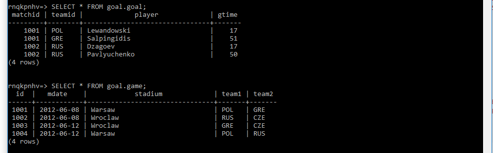
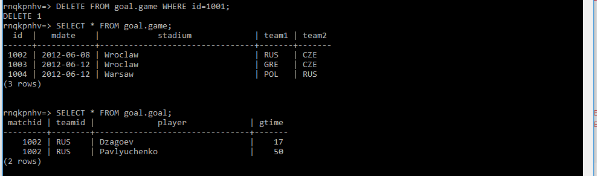

En caso de borrar un equipo, todos los registros asociados en goal y game pasan a tomar valor por defecto ('N/A'):

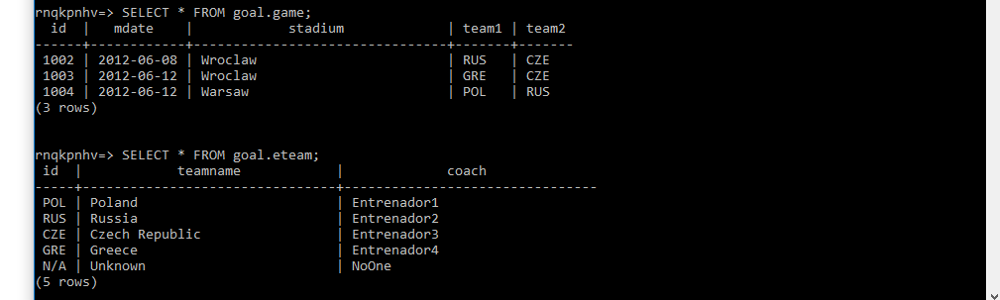
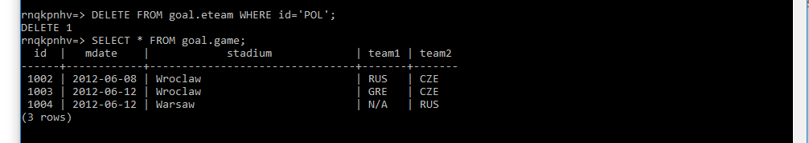

Ahora probemos simplemente a actualizar el valor de los registros. En cualquiera de los casos he especificado que debe realizarse en cascada:

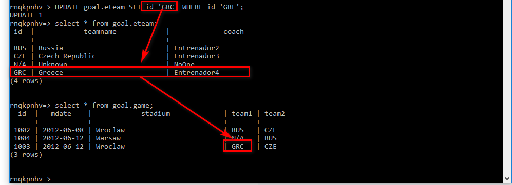
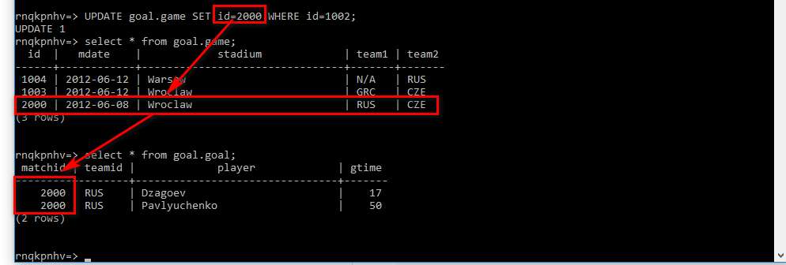

## BD movies
La base de datos movies es muy similar a la anterior, con lo cual no me voy a parar mucho en la misma.


### Crear BD Movies
```SQL
CREATE SCHEMA movies;

CREATE TABLE movies.actor(
	id integer PRIMARY KEY,
	name nchar(30) NOT NULL
);

CREATE TABLE movies.movie(
	id integer PRIMARY KEY,
	title nchar(30) NOT NULL,
	yr integer,
	director integer,
	budget bigint,
	gross bigint,
	FOREIGN KEY (director) REFERENCES actor(id) ON UPDATE CASCADE ON DELETE SET NULL
);

CREATE TABLE movies.casting(
	movieid integer NOT NULL,
	actorid integer,
	ord integer NOT NULL,
	PRIMARY KEY (movieid,actorid),
	FOREIGN KEY (movieid) REFERENCES movie(id) ON UPDATE CASCADE ON DELETE CASCADE, 
	FOREIGN KEY (actorid) REFERENCES actor(id) ON UPDATE CASCADE ON DELETE SET NULL
);
```

# Borrando esquema y tablas
Para crear un `SCHEMA` usamos la instrucción:
```SQL
CREATE SCHEMA <nombreSchema>;
```

Así mismo, para borrar el esquema, uso la siguiente instrucción:
```SQL
DROP SCHEMA <nombreSchema> CASCADE|RESTRICT;
```

Para este experimento creo un esquema llamado 'prueba', con una tabla empleado dentro:

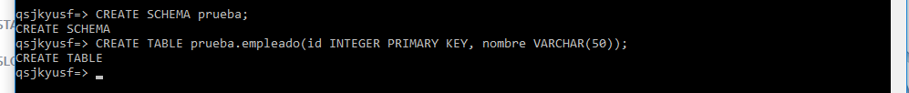

Esto lo hago para que, al intentar borrar el `SCHEMA` me de error. Esto se debe a que el `SCHEMA` tiene objetos dependientes por debajo (La Tabla empleado):

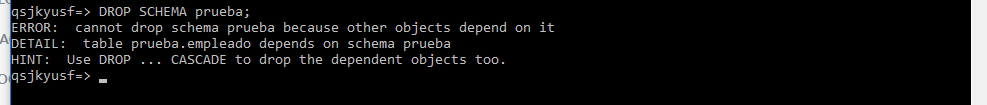

Para poder borrar el `SCHEMA` tenemos dos opciones. En primer lugar, borrar todos los objetos dependientes y posteriormente dicho `SCHEMA`. La otra alternativa sería realizar un borrado en `CASCADE`, es decir, que borre todos los objetos hijos y luego el `SCHEMA`:

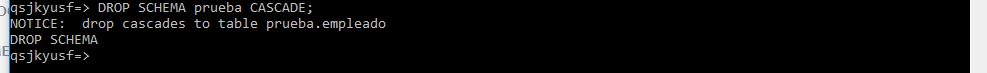

Para borrar tablas usamos la siguiente estructura:

```SQL
DROP TABLE <nombreTabla> CASCADE|RESTRICT;
```

Igual que pasó antes, la tabla podría tener objetos hijos los cuales impedirían un borrado que no fuera `CASCADE`. Pruebo un borrado con una nueva iteración de la tabla empleado:

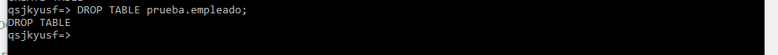

# Adición y borrado de columnas
Para añadir una columna a una tabla existente usamos la siguiente estructura:

```SQL
ALTER TABLE <nombreTabla> ADD COLUMN <nombrecolumna> tipo restricciones;
```

Añado por ejemplo el campo prueba entero:


Para borrar simplemente usamos:
```SQL
ALTER TABLE <nombreTabla> DROP COLUMN <nombrecolumna>;
```

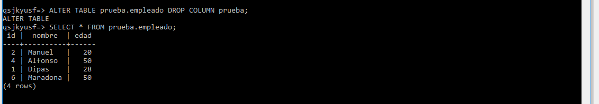

# Adición y borrado de restricciones
Para añadir una restricción usamos la siguiente sentencia:
```SQL
ALTER TABLE <nombreTabla> ADD [CONSTRAINT <nombre>] CHECK | PRIMARY KEY | FOREIGN KEY....;
```

Añado una restricción que compruebe que el nombre tenga al menos 5 letras. Pruebo a añadir 'Pepe', y da error:
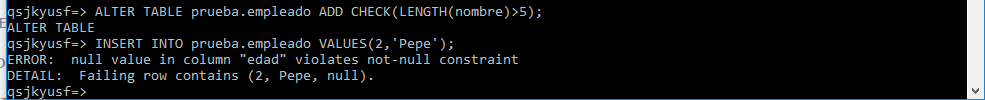

Como soy subnormal no le di nombre a la restricción. Si sois tan jodidamente deficientes como yo, teneis que comprobar el nombre de la restricción con el siguiente comando:
```SQL
	SELECT * FROM information_schema.table_constraints WHERE table_name='empleado';
```

De esta manera, compruebo las restricciones existentes en mi tabla (En este caso quiero borrar empleado_nombre_check):
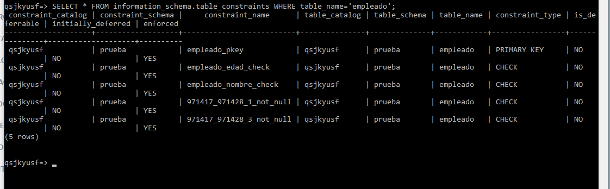

Sabiendo el nombre de la constraint, uso la siguiente sentencia para borrar:
```SQL
ALTER TABLE <nombreTabla> DROP CONSTRAINT <nombre>;
```

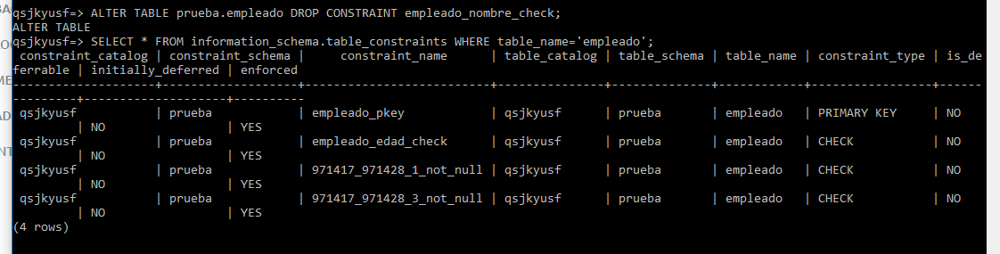


# Inserción, Modificación y Borrado de tuplas
Hago un insert con válidos:
```SQL
INSERT INTO prueba.empleado VALUES (1,'Dipas',28), (2,'Manuel',20), (3,'Jose Luis', 35), (4,'Alfonso', 50),(5,'Jose Doval', 35), (6,'maradona', 50);
```
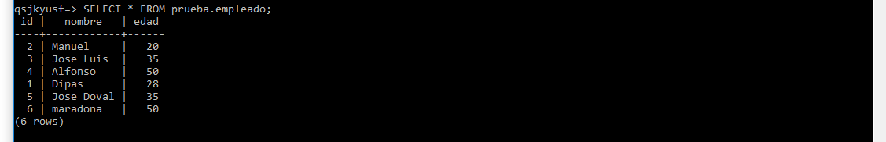

Supongamos que la he liado con un nombre y no le puse mayúscula. Necesito actualizar dicho registro ('maradona'). Uso update con la siguiente estructura:
```SQL
UPDATE <nombretabla> SET campo=valor WHERE (predicado);
```
Pongo Maradona donde el nombre sea maradona:
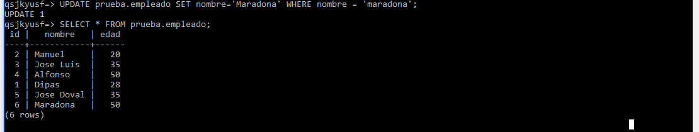

Por último, para borrar registros uso DELETE con la siguiente estructura:
```SQL
DELETE FROM <nombretabla> WHERE (predicado);

```
Borro aquellas tuplas cuyo campo nombre empiece por J:
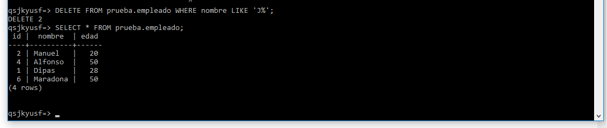

# Ejercicio 1 Proyectos de Investigacion
```SQL
DROP SCHEMA IF EXISTS Proyectos_Investigacion CASCADE;
 
CREATE SCHEMA Proyectos_Investigacion;

CREATE DOMAIN Proyectos_Investigacion.Nombre_Valido VARCHAR(30);

CREATE TABLE Proyectos_Investigacion.Sede (
	Nome_Sede Proyectos_Investigacion.Nombre_Valido PRIMARY KEY,
	Campus Proyectos_Investigacion.Nombre_Valido NOT NULL
);

CREATE TABLE Proyectos_Investigacion.Programa(
	Nome_Programa Proyectos_Investigacion.Nombre_Valido PRIMARY KEY
);

CREATE TABLE Proyectos_Investigacion.Proxecto(
	Codigo_Proxecto INTEGER PRIMARY KEY,
	Nome_Proxecto Proyectos_Investigacion.Nombre_Valido UNIQUE NOT NULL,
	Orzamento MONEY NOT NULL,
	Data_Inicio DATE NOT NULL,
	Data_Fin DATE,
	Nome_Grupo Proyectos_Investigacion.Nombre_Valido,
	Nome_Departamento Proyectos_Investigacion.Nombre_Valido,
	CHECK (Data_Inicio<Data_Fin),
	CHECK (Codigo_Proxecto>0)
);


CREATE TABLE Proyectos_Investigacion.Profesor(
	Dni CHAR(9) PRIMARY KEY,
	Nome_Profesor Proyectos_Investigacion.Nombre_Valido NOT NULL,
	Titulacion Proyectos_Investigacion.Nombre_Valido NOT NULL,
	Experiencia INTEGER,
	Nome_Grupo Proyectos_Investigacion.Nombre_Valido,
	Nome_Departamento Proyectos_Investigacion.Nombre_Valido,
	CHECK (LENGTH(Dni)=9)
);

CREATE TABLE Proyectos_Investigacion.Grupo(
	Nome_Grupo Proyectos_Investigacion.Nombre_Valido,
	Nome_Departamento Proyectos_Investigacion.Nombre_Valido,
	Area Proyectos_Investigacion.Nombre_Valido NOT NULL,
	Lider CHAR(9),
	PRIMARY KEY (Nome_Grupo, Nome_Departamento)
);

CREATE TABLE Proyectos_Investigacion.Departamento(
	Nome_Departamento Proyectos_Investigacion.Nombre_Valido PRIMARY KEY,
	Telefono INTEGER NOT NULL,
	Director CHAR(9)
);

CREATE TABLE Proyectos_Investigacion.Ubicacion(
 	Nome_Sede Proyectos_Investigacion.Nombre_Valido,
	Nome_Departamento Proyectos_Investigacion.Nombre_Valido,
	PRIMARY KEY(Nome_Sede, Nome_Departamento)
	
);

CREATE TABLE Proyectos_Investigacion.Participa(
	Dni CHAR(9),
	Codigo_Proxecto INTEGER,
	Data_Inicio DATE NOT NULL,
	Data_Cese DATE,
	Participacion Proyectos_Investigacion.Nombre_Valido,
	PRIMARY KEY (Dni, Codigo_Proxecto),
	CHECK(Data_Cese IS NULL OR (Data_Cese IS NOT NULL AND Data_Cese>Data_Inicio)) 
);

CREATE TABLE Proyectos_Investigacion.Financia(
	Nome_Programa Proyectos_Investigacion.Nombre_Valido,
	Codigo_Proxecto INTEGER,
	Numero_Proxecto INTEGER NOT NULL,
	Cantidade_Financiada MONEY NOT NULL,
	PRIMARY KEY (Nome_Programa, Codigo_Proxecto)
);

ALTER TABLE Proyectos_Investigacion.Proxecto ADD FOREIGN KEY (Nome_Grupo, Nome_Departamento)
REFERENCES Proyectos_Investigacion.Grupo (Nome_Grupo, Nome_Departamento) ON DELETE SET NULL ON UPDATE CASCADE;

ALTER TABLE Proyectos_Investigacion.Profesor ADD FOREIGN KEY (Nome_Grupo, Nome_Departamento)
REFERENCES Proyectos_Investigacion.Grupo (Nome_Grupo, Nome_Departamento) ON DELETE SET NULL ON UPDATE CASCADE;

ALTER TABLE Proyectos_Investigacion.Grupo ADD FOREIGN KEY (Lider)
REFERENCES Proyectos_Investigacion.Profesor (Dni) ON DELETE SET NULL ON UPDATE CASCADE;

ALTER TABLE Proyectos_Investigacion.Grupo ADD FOREIGN KEY (Nome_Departamento)
REFERENCES Proyectos_Investigacion.Departamento (Nome_Departamento) ON DELETE CASCADE ON UPDATE CASCADE;

ALTER TABLE Proyectos_Investigacion.Participa ADD FOREIGN KEY (Codigo_Proxecto)
REFERENCES Proyectos_Investigacion.Proxecto (Codigo_Proxecto) ON UPDATE CASCADE;

ALTER TABLE Proyectos_Investigacion.Participa ADD FOREIGN KEY (Dni)
REFERENCES Proyectos_Investigacion.Profesor (Dni) ON UPDATE CASCADE;

ALTER TABLE Proyectos_Investigacion.Financia ADD FOREIGN KEY (Nome_Programa)
REFERENCES Proyectos_Investigacion.Programa (Nome_Programa) ON UPDATE CASCADE ON DELETE CASCADE;

ALTER TABLE Proyectos_Investigacion.Financia ADD FOREIGN KEY (Codigo_Proxecto)
REFERENCES Proyectos_Investigacion.Proxecto (Codigo_Proxecto) ON DELETE CASCADE ON UPDATE CASCADE;

ALTER TABLE Proyectos_Investigacion.Ubicacion ADD FOREIGN KEY (Nome_Sede)
REFERENCES Proyectos_Investigacion.Sede (Nome_Sede) ON DELETE CASCADE ON UPDATE CASCADE;

ALTER TABLE Proyectos_Investigacion.Ubicacion ADD FOREIGN KEY (Nome_Departamento)
REFERENCES Proyectos_Investigacion.Departamento (Nome_Departamento) ON DELETE CASCADE ON UPDATE CASCADE;

ALTER TABLE Proyectos_Investigacion.Departamento ADD FOREIGN KEY (Director)
REFERENCES Proyectos_Investigacion.Profesor (Dni) ON DELETE SET NULL ON UPDATE CASCADE;
```

Suposiciones (Pendientes de añadir):
- Podria usarse un assert para comprobar que todo el dinero de financiacion se invierte en el proyecto (Orzamento, Financiacion)
- Comprobar las fechas de fin y cese de participa se corresponden con las fechas de inicio y fin del proyecto. Otro assert

# Ejercicio 2 Naves Espaciales
```sql
DROP SCHEMA IF EXISTS Naves_Espaciais CASCADE;
 
CREATE SCHEMA Naves_Espaciais;

CREATE TABLE Naves_Espaciais.Servizo(
	Clave_Servizo CHAR(9),
	Nome_Servizo VARCHAR(30),
	PRIMARY KEY(Clave_Servizo, Nome_Servizo),
	CHECK(LENGTH(Clave_Servizo)=9)	
);

CREATE TABLE Naves_Espaciais.Dependencia(
	Codigo_Dependencia SERIAL PRIMARY KEY,
	Nome_Dependencia VARCHAR(30) NOT NULL UNIQUE,
	Clave_Servizo CHAR(9) NOT NULL,
	Nome_Servizo VARCHAR(30) NOT NULL,
	Funcion VARCHAR(30),
	Localizacion VARCHAR(30),
	FOREIGN KEY(Clave_Servizo, Nome_Servizo) REFERENCES Naves_Espaciais.Servizo(Clave_Servizo, Nome_Servizo)
	ON UPDATE CASCADE
	ON DELETE CASCADE
);

CREATE TABLE Naves_Espaciais.Camara(
	Codigo_Dependencia INTEGER PRIMARY KEY,
	Categoria VARCHAR(30) NOT NULL,
	Capacidade INTEGER NOT NULL,
	CHECK(Capacidade > 0),
	FOREIGN KEY(Codigo_Dependencia) REFERENCES Naves_Espaciais.Dependencia(Codigo_Dependencia)
	ON DELETE CASCADE
	ON UPDATE CASCADE
);

CREATE TABLE Naves_Espaciais.Raza(
	Nome_Raza VARCHAR(30) PRIMARY KEY,
	Altura DECIMAL NOT NULL,
	Anchura DECIMAL  NOT NULL,
	Peso DECIMAL NOT NULL,
	Poboacion_Total BIGINT NOT NULL,
	CHECK(Altura > 0 AND Anchura > 0 AND Peso > 0 AND Poboacion_Total >= 0)
);

CREATE TABLE Naves_Espaciais.Planeta(
	Codigo_Planeta SERIAL PRIMARY KEY,
	Nome_Planeta VARCHAR(30) UNIQUE NOT NULL,
	Galaxia VARCHAR(30) NOT NULL,
	Coordenadas VARCHAR(15) UNIQUE NOT NULL
);

CREATE TABLE Naves_Espaciais.Habita(
	Codigo_Planeta INTEGER,
	Nome_Raza VARCHAR(30),
	Poboacion_Parcial BIGINT NOT NULL,
	CHECK (Poboacion_Parcial>=0),
	PRIMARY KEY(Codigo_Planeta, Nome_Raza),
	FOREIGN KEY(Codigo_Planeta) REFERENCES Naves_Espaciais.Planeta(Codigo_Planeta)
	ON UPDATE CASCADE ON DELETE CASCADE,
	FOREIGN KEY(Nome_Raza) REFERENCES Naves_Espaciais.Raza(Nome_Raza)
	ON UPDATE CASCADE ON DELETE CASCADE
);

CREATE TABLE Naves_Espaciais.Tripulacion(
	Codigo_Tripulacion SERIAL PRIMARY KEY,
	Nome_Tripulacion VARCHAR(30) NOT NULL,
	Codigo_Camara INTEGER NOT NULL,
	Codigo_Dependencia INTEGER NOT NULL,
	Categoria VARCHAR(30) NOT NULL,
	Antiguedade INTEGER NOT NULL,
	Procedencia VARCHAR(30) NOT NULL,
	Administracion VARCHAR(30) NOT NULL,
	CHECK(Antiguedade>=0),
	CHECK(Administracion='En servicio' OR Administracion='De baja'),
	FOREIGN KEY(Codigo_Camara) REFERENCES Naves_Espaciais.Camara(Codigo_Dependencia)
	ON UPDATE CASCADE ON DELETE CASCADE,
	FOREIGN KEY(Codigo_Dependencia) REFERENCES Naves_Espaciais.Dependencia(Codigo_Dependencia)
	ON UPDATE CASCADE ON DELETE CASCADE
);

CREATE TABLE Naves_Espaciais.Visita(
	Codigo_Tripulacion INTEGER,
	Codigo_Planeta INTEGER,
	Data_Visita DATE,
	Tempo INTEGER NOT NULL,
	CHECK(Tempo>=0),
	PRIMARY KEY(Codigo_Tripulacion,Codigo_Planeta,Data_Visita),
	FOREIGN KEY(Codigo_Tripulacion) REFERENCES Naves_Espaciais.Tripulacion(Codigo_Tripulacion)
	ON UPDATE CASCADE ON DELETE CASCADE,
	FOREIGN KEY(Codigo_Planeta) REFERENCES Naves_Espaciais.Planeta(Codigo_Planeta)
	ON UPDATE CASCADE ON DELETE CASCADE
);


```

Suposiciones:

	- Se debería comprobar que el numero de tripulantes no supere la capacidad de la cámara
	- En general los tipos de dato son ambiguos:
		- En general los códigos los pongo como enteros (Probar SERIAL)
		- Visita.Tempo lo pongo como entero, supongo que se trata del numero de horas
		- La clave de servicio es un codigo de 9 caracteres
	- SERIAL es un entero autoincrementado. Como no nos interesa que los campos que referencian a un SERIAL se autoincrementen tambien, hacemos que sean enteros
		

---------------------
Ejercicio de prueba:

```sql

-- A FOREIGN KEY de profesor esta mal. Hacer una nueva con B:N M:R

ALTER TABLE Profesor
	DROP CONSTRAINT FK_Grupo_Profesor;

ALTER TABLE Profesor
	ADD CONSTRAINT FK_GP_Profesor FOREIGN KEY (Nome_Grupo, Nome_Departamento)
	REFERENCES Proyectos_Investigacion.Grupo (Nome_Grupo, Nome_Departamento) 
	ON DELETE SET NULL ON UPDATE NO ACTION;
```
