TAREA 1 - SECCION 2 - ELEPHANT SQL
--------------------

# Indice
- [¿Que es Elephant?](#¿que-es-elephant?)
- [Creando Instancias](#creando-instancias)
- [Instalando pgadmin y SQLshell](#instalando-pgadmin-y-sqlshell-psql)
- [Acceder al servidor desde psql](#acceder-al-servidor-desde-psql)
- [Acceder al servidor desde pgadmin](#acceder-al-servidor-desde-pgadmin)
- [Empezar a Trabajar](#empezar-a-trabajar)
  - [A golpe de comando](#a-golpe-de-comando)
  - [Desde la propia web de ElephantSQL](#desde-la-propia-web-de-elephantsql)
  - [Desde pgadmin](#desde-pgadmin)
  
# ¿Que es ElephantSQL?
ElephantSQL es una plataforma de hosting de base de datos, que nos permite trabajar con Bases de datos de PostgreSQL en la nube, mientras el mismo se encarga de la instalación, actualizaciones o copias de seguridad.

[Enlace a ElephantSQL](https://www.elephantsql.com/)

[Volver al indice](#indice)

# Creando instancias
Lo primero que tenemos que hacer es crear una cuenta propia. Se nos da opciones como crearla desde cero o incluso vincular una cuenta de GitHub. Una vez creada dicha cuenta, es hora de crear instancias para cada una de las bases de datos que vamos a crear (La idea es copiar aquellas presentes en SQLZOO).

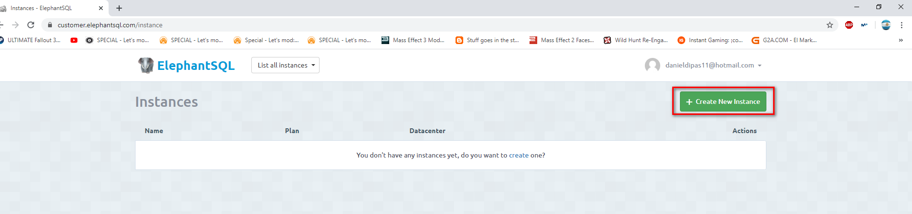

Cada una de estas instancias cuenta con un Plan específico adaptado a nuestras necesidades (Variados capacidad de almacenaiento, velocidad de acceso, conexiones concurrentes, followers...). Para nosotros el plan gratuito es mas que suficiente, pero hemos de tener en cuenta en todo momento que solo contamos con 20MB de almacenamiento y un maximo de cinco conexiones concurrentes.

Una vez seleccionado el plan, es hora de darle nombre a nuestra instancia. Como ya dije antes, creo una instancia por cada base de datos de SQLZOO (world, nobel, movies, goal...). Las etiquetas, si bien útiles cuando se amontonan gran cantidad de instancias distintas agrupadas por temas similares, no las considero necesarias en este caso. 

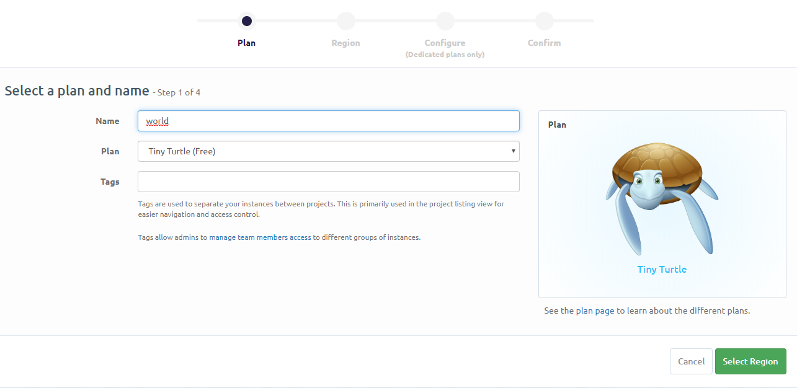

Es hora de elegir un servicio de hosting. Existen varios disponibles (Amazon, Google, Azure...). El que mas nos guste o mas cercano sea a nuestra zona.

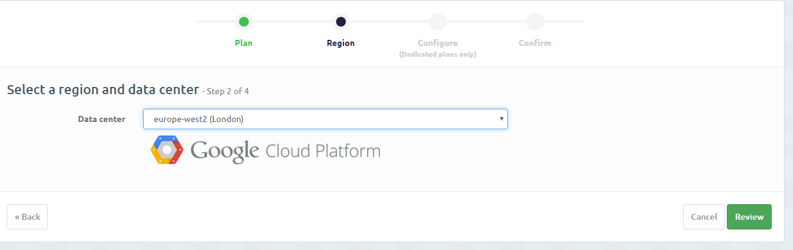

Creada la primera instancia, repetimos el proceso hasta tener las cuatro base de datos de SQLZOO repartidas con una instancia cada una.

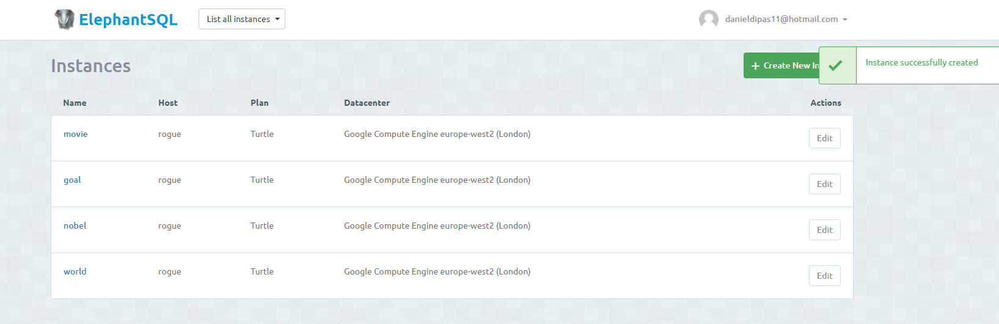

Cada instancia contará con un servidor (Dependiente de la plataforma de hosting), un usuario y base de datos por defecto y una contraseña (El puerto suele ser 5432). Debemos tener presentes estos datos a la hora de conectarse al servidor de base de datos mas adelante.

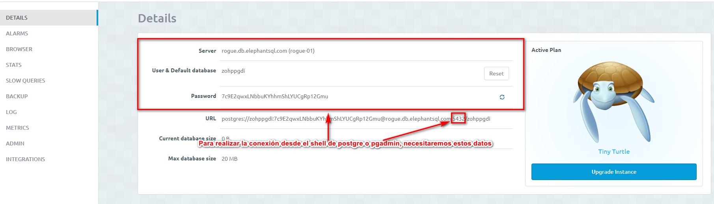

Teniendo esto en cuenta, dejamos nuestra cuenta de Elephant por el momento, y vamos a trabajar en Windows.

[Volver al indice](#indice)

# Instalando PGAdmin y SQLShell psql
Descargamos el instalador de PostgreSQL.
[Enlace](https://www.postgresql.org/download/)

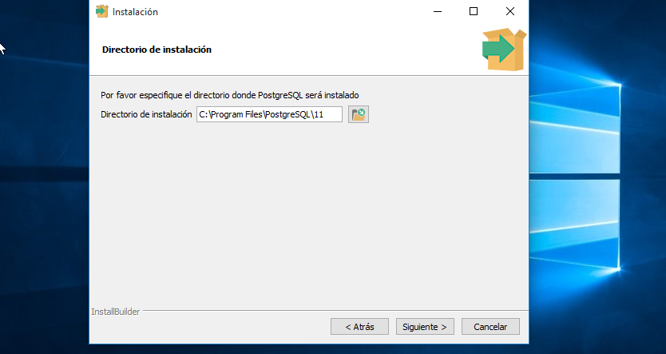

El instalador de Postgre trae varias características como el servidor, Stack Builder (que facilita la incorporación de nuevos módulos al sistema), pero las dos cosas que nos interesan son Pgadmin, que nos permite gestionar las bases de datos a través de interfaz gráfica, y Command Line Tools, que permite lo mismo pero a golpe de comandos. Voy a explicar como poner en funcionamiento cada una, pero la idea es trabajar con comandos una vez detallada la configuración.

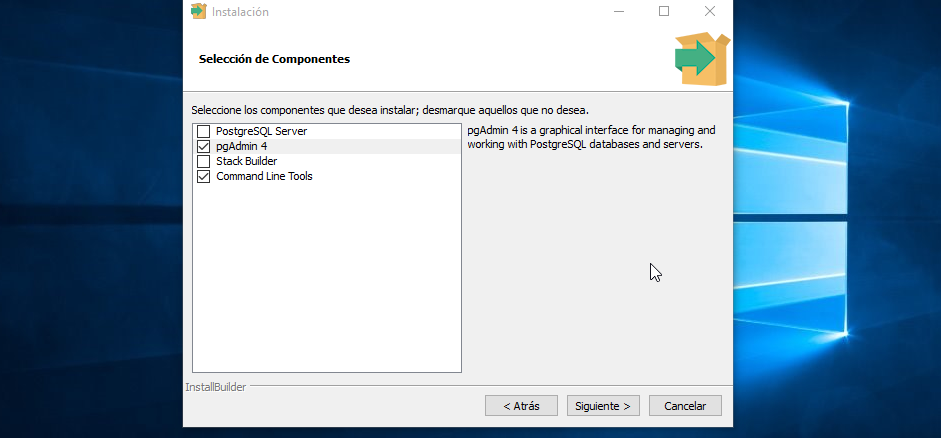

[Volver al indice](#indice)

# Acceder al Servidor desde psql
Para acceder al servidor desde psql, nos vamos al CMD y usamos el comando SQL con la siguiente estructura:
> Ruta\psql.exe -h servidor -U usuario -d basededatospordefecto -p puerto

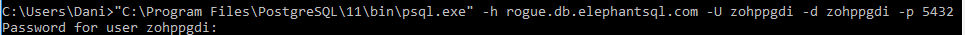

Hasta donde se, no hay manera de incluir la contraseña en este comando, ya que se considera extremadamente inseguro.

Una vez realizada la conexión e indicada la contraseña, ya podemos empezar a trabajar con nuestra base de datos desde la linea de comandos, haciendo las operaciones de DQL o DML vistas hasta ahora.

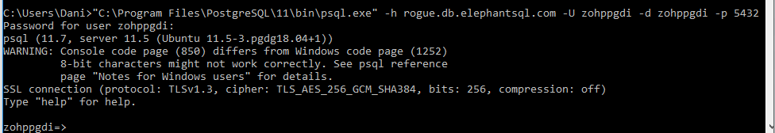

[Volver al indice](#indice)

# Acceder al Servidor desde Pgadmin
Abrimos pgadmin, que nos proporciona una interfaz en el navegador para gestionar la base de datos. PAra el primer uso, nos perdirá una contraseña para el usuario master.

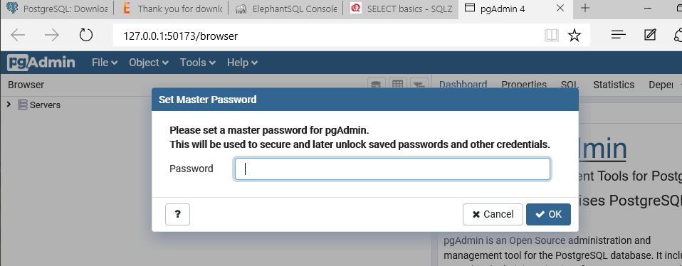

Creamos un nuevo servidor, el cual se conectará al de ElephantSQL:

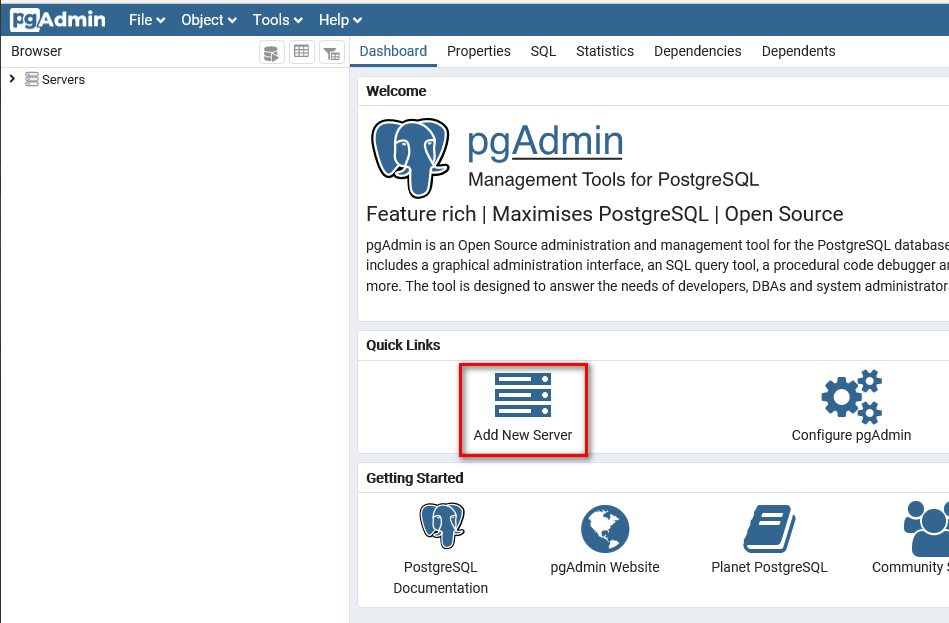

Le damos nombre a la conexión, la cual no necesariamente tiene que verse correspondida con el nombre de la base de datos.

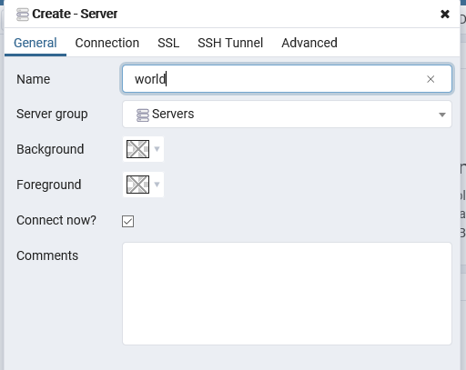

Volvemos a usar los datos de la instancia de ElephantSQL para indicar servidor, usuario, base de datos y contraseña.

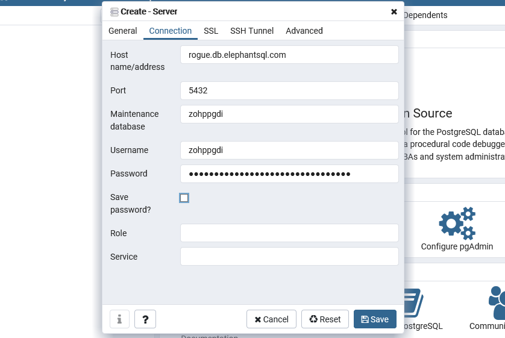

Creada la conexión ya podemos empezar a trabajar con la base de datos de Elephant. En este momento ya habia creado la tabla world y metido un par de datos desde la linea de comandos, con lo cual podemos ver los resultados desde la interfaz.

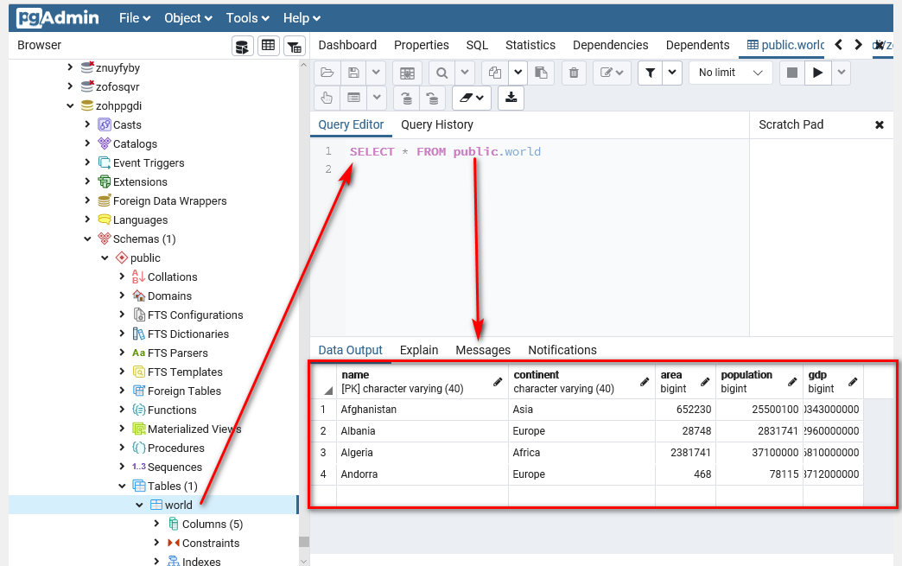

[Volver al indice](#indice)

# Empezar a trabajar
A partir de aquí tenemos tres opciones para ejecutar instrucciones SQL en nuestra instancia ElephantSQL.

## A golpe de comando
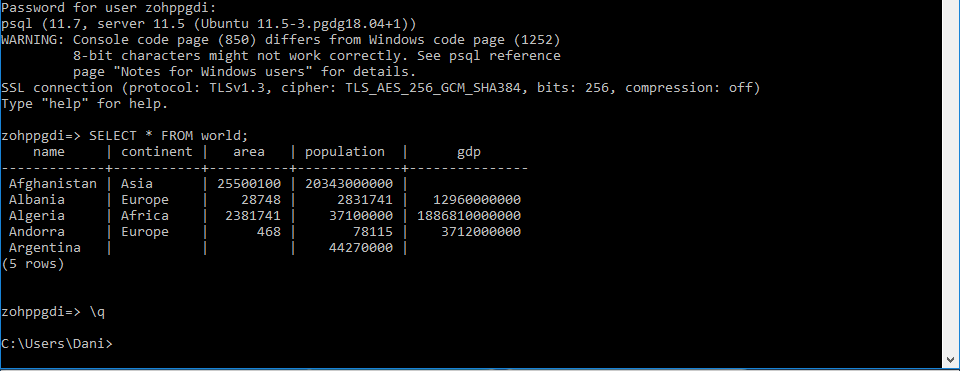

## Desde la propia web de ElephantSQL
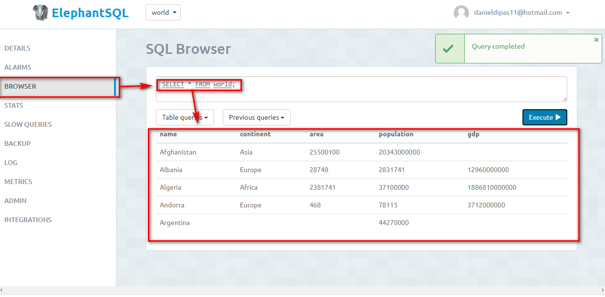

## Desde pgadmin

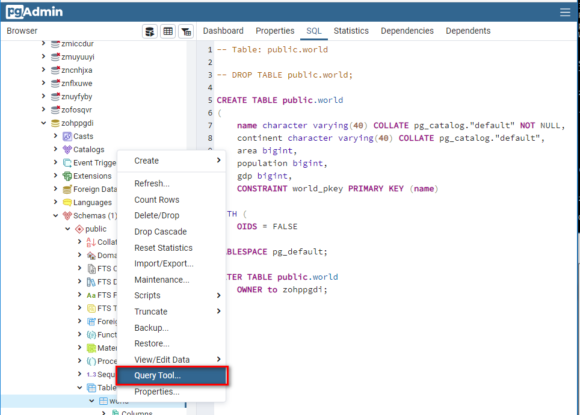

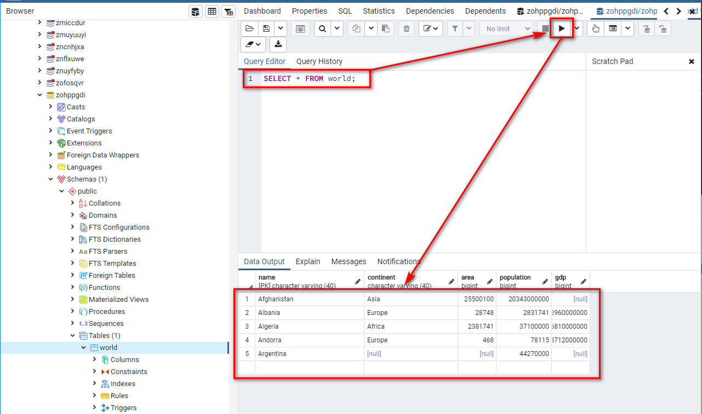

[Volver al indice](#indice)
