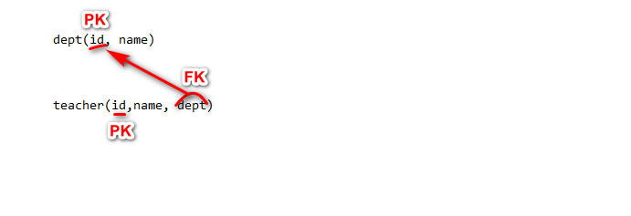
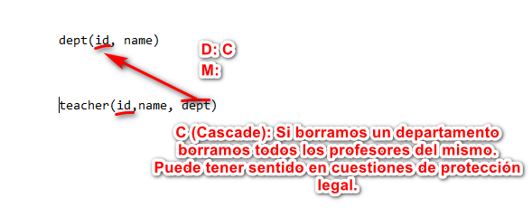
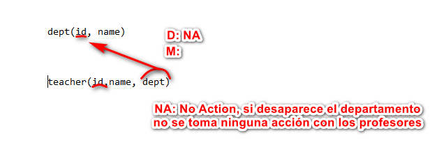
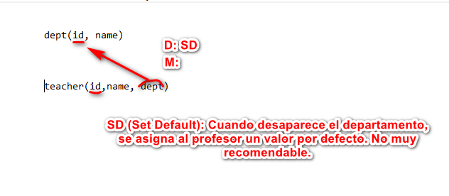
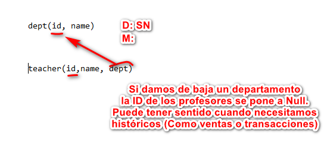

TAREA 1 - Sección 1 - SUBLENGUAJES
-----------------------

# Indice
- [Sublenguajes](#sublenguajes)
- [DDL Data Definition Language](#ddl-data-definition-language)
	- [CREATE SCHEMA DATABASE](#create-schema-o-database)
	- [CREATE TABLE](#create-table)
		- [DECLARACION DE CAMPOS](#declaracion-de-campos)
			- [CONSTRAINT PK](#constraint-pk)
			- [CONSTRAINT FK](#constraint-fk)
				- [CASCADE](#cascade)
				- [NO ACTION](#no-action)
				- [SET DEFAULT](#set-default)
				- [SET NULL](#set-null)
				- [MATCH FULL](#match-full)
				- [MATCH PARTIAL](#match-partial)
			- [CONSTRAINT UNIQUE](#constraint-unique)
			- [CONSTRAINT DEFAULT](#constraint-default)
			- [CONSTRAINT CHECK](#constraint-check)
			- [CONSTRAINT ASSERTION](#constraint-assertion)
	- [DROP](#drop)
		- [DROP SCHEMA o DATABASE](#drop-schema-o-database)
		- [DROP TABLE](#drop-table)
	- [ALTER](#alter)
		- [ADD COLUMN](#add-column)
		- [ALTER COLUMN](#alter-column)
		- [DROP COLUMN](#drop-column)
		- [ADD CONSTRAINT](#add-constraint)
		- [DROP CONSTRAINT](#drop-constraint)
- [DML Data Manipulation Language](#ddl-data-manipulation-language)
	- [INSERT](#insert)
	- [UPDATE](#update)
	- [DELETE](#delete)
- [GOTCHAs](#gotchas)

-----------------------

# Sublenguajes
- `DDL Data Definition Lenguage` (Opera sobre los objetos de la BD. Tablas, fila, columna, indice...)
	- CREATE
	- ALTER
	- DROP

- `DML Data Manipulation Language` (Antes SELECT se incluía ahi. Opera sobre los datos)
	- UPDATE 
	- INSERT
	- DELETE
	
- `DCL Data Control Language` (Permisos)
	- GRANT
	- REVOKE
	
- `SCL Session Control Language` (Manejar dinamicamente propiedades de sesión de usuario)
	- ALTER SESSION
	- SET ROLE
	
- `TCL Transaction Control Language` (Unidad logica de procesado compuesta por varias transacciones)
	- Commit
	- Rollback
	- SafePoint

- `DQL Data Query Language` (Relativamente nuevo para englobar a SELECT, que es muy potente. Opera sobre los datos)
	- SELECT

[Volver al Indice](#indice)

# DDL Data Definition Language
Permite definir objetos (esquemas, bases de datos, columnas, restricciones... ) en una base de datos.

## CREATE SCHEMA o DATABASE 
Para crear base de datos, utilizamos la siguiente sintaxis:

```sql
CREATE (SCHEMA|DATABASE) [IF NOT EXISTS] [CHARACTER SET <Nombre Charset> [COLLATE <Nombre_Variante>]] << NombreBD >>;
```

En general las bases de datos y los esquemas se comportan de la misma manera, habiendo algunas diferencias en el tratamiento de permisos.

Estructura:
```sql
CREATE DATABASE nombreBD;
```

Alternativa:
```sql
 CREATE SCHEMA nombreBD;
```

Opciones:
- `IF NOT EXISTS`: Opcional. Comprueba si la base de datos que vamos a crear ya existe en el SGBD.
- `CHARACTER SET`: Opcional. CHARACTER SET especifica el conjunto de caracteres que se va a utilizar (Ejemplo: latin1).
- `COLLATE`: Opcional. Se combina con CHARACTER SET. Ayuda a elegir la variante esepecífica dentro de dicho conjunto (Ejemplo: latin1_swedish_ci)

[Volver al Indice](#indice)

## CREATE TABLE
Para crear Tablas, utilizamos la siguiente sintaxis:

```sql
 CREATE TABLE <NombreTabla> (
	<nombrecampo> tipoDato [PRIMARY KEY][UNIQUE][NOT NULL][CHECK(predicado)][DEFAULT <valorPorDefecto>],
	<nombrecampo2> tipoDato [PRIMARY KEY][UNIQUE][NOT NULL][CHECK(predicado)],
	.....
	[CONSTRAINT <NombrePK>] PRIMARY KEY (atributo1, atributo2....),
	[CONSTRAINT <nombreRestriccion>] UNIQUE(<nAtributos>),
	[CONSTRAINT <nombreRestriccion>] CHECK predicado(atributos),
	[CONSTRAINT <nombreRestriccion>] DEFAULT <valor> FOR <campo>,
	[CONSTRAINT <nombreRestriccion>] FOREIGN KEY (<Atributos>) REFERENCES <Nombre_tabla_referenciada>[(<Atributos_referenciados>)]
	[ON DELETE CASCADE|NO ACTION|SET NULL|SET DEFAULT]
	[ON UPDATE CASCADE|NO ACTION|SET NULL|SET DEFAULT]
	[MATCH FULL| MATCH PARTIAL]
	); <
	
```

[Volver al Indice](#indice)

### Declaracion de campos
Para declarar un campo a la hora de definir una tabla, se sigue la siguiente estructura:
```sql
<nombrecampo> tipoDato [PRIMARY KEY][UNIQUE][NOT NULL]
```

Los campos que vamos a definir dentro de la tabla pueden tener los siguientes tipos, entre los cuales debemos elegir uno que represente con exactitud el dato que queremos reflejar:

- Numericos
	- `INTEGER`
	- `BIGINT`
	- `SMALLINT`
	- `DECIMAL` (Preciso)
	- `REAL` (No preciso, 6 Decimales)

- Textos
	- `CHAR` (Longitud fija)
	- `VARCHAR` (Longitud Variable)
	- `TEXT` (Logitud ilimitada variable)

- Fechas
	- `DATE` (Dia, mes y año)
	- `TIME` (Hora, minuto y segundo)
	- `TIME WITH TIME ZONE` (Hora, minuto y segundo con zona horaria)
	- `TIMESTAMP` (Incluye Date y Time)
	- `TIMESTAMP WITH TIME ZONE` (Incluye Date y Time con zona horaria)
	- `INTERVAL`

- Booleano
	- `BOOLEAN` (true, false, null. En el input acepta 1, yes, t, y como true, y 0, no, n, f como false) 

- Moneda
	- `MONEY`
	
- Otros
	- `UUID` (Identificador Único)
	- `JSON`
	- `CIDR` (Redes)
	- `INET` (Redes)

Podemos definir nuestros propios Dominios de dato, partiendo de los tipos anteriores:

```sql
	CREATE DOMAIN <nombre_Tipo_Dato> Tipo;
```

Por ejemplo, para un DNI podemos crear un dominio que sea una cadena fija de 9 caracteres, un codigo de 5 caracteres o un nombre:

```sql
	CREATE DOMAIN Tipo_DNI CHAR(9);
	CREATE DOMAIN Tipo_Codigo CHAR(5);
	CREATE DOMAIN Nome_Valido VARCHAR(30);
```

Estos dominios son especialmente útiles cuando se utilizan tipos de dato concretos muy repetidamente en la base de datos en general. De esta manera, si ese tipo de dato cambia en el tiempo, solo tocando el dominio definido modificamos el tipo de dato de todos los campos que lo usen (No tendriamos que ir campo por campo).

Se pueden declarar múltiples campos, cada uno con su respectivo tipo de dato, hasta que cumplamos las condiciones de la base de datos. A la hora de declarar el propio campo, se pueden definir las siguientes constraints opcionales:
- `PRIMARY KEY`
- `UNIQUE`
- `NOT NULL`
- `CHECK`

A continuación procedo a explicar cada una.

[Volver al Indice](#indice)

#### CONSTRAINT PK
La constraint PRIMARY KEY indica que campo/s forman parte de la clave principal, que indica el campo que actúa como diferenciador a nivel tupla. Hay varias maneras de utilizarlo. 

En primer lugar podemos definir la clave principal en la misma definicion del campo:

```sql
 CREATE TABLE <NombreTabla> (
	id INTEGER PRIMARY KEY,
	...
	); <
```

Se puede definir al final, especialmente cuando la clave es compuesta:
```sql
 CREATE TABLE <NombreTabla> (
	id INTEGER ,
	nome NCHAR(50) NOT NULL,
	apelidos NCHAR(200),
	nacido DATE,
	PRIMARY KEY (id)
	);
```

Podemos darle nombre al constraint, útil especificamente para DBAs:
```sql
 CREATE TABLE <NombreTabla> (
	id INTEGER ,
	nome NCHAR(50) NOT NULL,
	apelidos NCHAR(200),
	nacido DATE,
	CONSTRAINT nombre PRIMARY KEY (id)
	);
```

[Volver al Indice](#indice)

#### CONSTRAINT FK
Nos permite `establecer la relación entre varias tablas`, especificando los campos que tienen en común. Estructura:

```sql
[CONSTRAINT <nombreRestriccion>] FOREIGN KEY (<Atributos>) REFERENCES <Nombre_tabla_referenciada>[(<Atributos_referenciados>)]
[ON DELETE CASCADE|NO ACTION|SET NULL|SET DEFAULT]
[ON UPDATE CASCADE|NO ACTION|SET NULL|SET DEFAULT]
[MATCH FULL| MATCH PARTIAL]
```

Podemos especificar que operaciones se van a realizar si en la misma tabla se producen modificaciones, indicando como va a afectar a las que están enlazadas a través de clave ajena:

> Borrado: `ON DELETE` CASCADE|NO ACTION|SET NULL|SET DEFAULT
> Actualizaciones: `ON UPDATE` CASCADE|NO ACTION|SET NULL|SET DEFAULT

Vamos a ver los tipos de acciones que se pueden tomar tras un UPDATE o un DELETE usando una Base de Datos con tablas de departamentos y profesores relacionadas:



[Volver al Indice](#indice)

##### CASCADE 
El borrado de un registro, borra todos los registros de la otra tabla que referencien a esa tupla


		

##### NO ACTION
`Valor por defecto` si no especificamos uno. No toma acciones a mayores si se produce borrado o modificacion.



##### SET DEFAULT
Cambia el valor en la tabla ajena a un valor por defecto.



##### SET NULL
Cambia el valor en la tabla ajena a un valor nulo.



##### MATCH FULL
Las coincidencias entre claves ajenas y referenciadas ha de ser completa, es decir, o coinciden los datos en ambas tablas, o han de ser todos `NULL`, no solo uno.

##### MATCH PARTIAL
No es necesario que las coincidencias sean completas. Por ejemplo, puede que en `FOREIGN KEY` multicolumna, la relación tenga `NULL` en parte de la clave. Con `MATCH FULL`, esto no sería posible salvo que todas las columnas relacionadas sean `NULL`, mientras que `MATCH PARTIAL` si que lo permite.

[Volver al Indice](#indice)

#### CONSTRAINT UNIQUE 
Nos permite especificar que los valores de un campo no se pueden repetir. Habitual para claves candidatas que no han sido elegidas como principales en una tabla. Puede definirse de dos maneras, siendo la primera en la declaración del campo:

```sql
 CREATE TABLE <NombreTabla> (
	idalternativa INTEGER UNIQUE,
	...
	); <
```

Como alternativa, podemos definir un campo `UNIQUE` como una restriccion aparte, ya sea especificando nombre de `CONSTRAINT` o no:

```sql
	[CONSTRAINT <nombreRestriccion>] UNIQUE(<nAtributos>)
```

[Volver al Indice](#indice)

#### CONSTRAINT DEFAULT
Nos permite añadir un valor por defecto a un campo, en caso de que en la introducción de la tupla no sea especificado uno distinto. Se puede especificar en la propia declaración del campo a la hora de crear la tabla:

```sql
 CREATE TABLE <NombreTabla> (
	numero INTEGER DEFAULT 1,
	...
	); <
```

También se puede crear la `CONSTRAINT` de la declaración de campos:

```sql
	[CONSTRAINT <nombreRestriccion>] DEFAULT 1 FOR numero
```

[Volver al Indice](#indice)

#### CONSTRAINT CHECK
Objeto de la tabla. Permite introducir un predicado de manera que comprueba cualquier modificación, borrado o inserción (DML), y la realiza si cumple dicho predicado, es decir, cuando devuelve `true`. Puede introducirse de varias maneras, siendo la primera en la declaración del propio campo:

```sql
 CREATE TABLE <NombreTabla> (
	campo INTEGER CHECK(predicado),
	...
	); <
```

Por otra parte, podemos definirlo como una constraint al final:
```sql
	[CONSTRAINT <nombreRestriccion>] CHECK(predicado)
```

[Volver al Indice](#indice)

##### Modificadores
Tiene dos modificadores:
- `[NOT] DEFERRABLE`: Determina si la aplicación del check es aplazable (`DEFERRABLE`) o no (`NOT DEFERRABLE`). Por defecto no es aplazable. Tiene sentido aplazar el check cuando se habla de grandes transacciones. Puede interesar que se llegue al final de dichas transacciones, de ahi que se pueda aplazar. 
- `INITIALLY[IMMEDIATE|DEFERRABLE]`: 
	- `INITIALLY DEFERRABLE` va con `DEFERRABLE`. Lo aplaza
	- `INITIALLY INMEDIATE` va con `NOT DEFERRABLE`. Lo hace inmediatamente 
	
##### Predicado
Un predicado de un `CHECK` es útil para comprobar si el campo introducido cumple un requisito. En caso de cumplirlo devuelve `true` y la modificación se realiza y en caso contrario devuelve `false` y al carrer. Ejemplo que comprueba que en una inserción o modificación el campo saldo sea mayor que 0:

```sql
CHECK (saldo>0)
```

Podemos incluir subconsultas en el predicado de un check:
```sql
CHECK (saldo >= (
	SELECT saldo
	FROM empleado
	WHERE departamento ='A'))
```

[Volver al Indice](#indice)

#### CONSTRAINT ASSERTION
Nos permite realizar comprobaciones incorporando datos de múltiples tablas, ya que, a diferencia de `CHECK`, es un objeto de la base de datos.

```sql
CREATE ASSERTION <NombreAsercion>
	CHECK (Predicado);
```

[Volver al Indice](#indice)

----------------------------------
## DROP
La instrucción `DROP` nos permite borrar objetos de la base de datos o la propia base de datos.

[Volver al Indice](#indice)

### DROP SCHEMA o DATABASE
Esta instrucción nos permite borrar el `SCHEMA` o `DATABASE`. Estructura:

```sql
DROP SCHEMA [IF EXISTS] <nome-da-bd>;
	....
DROP DATABASE [IF EXISTS] <nome-da-bd>;
```
La cláusula opcional `IF EXISTS` comprueba que la base de datos existe antes de borrarla.

[Volver al Indice](#indice)

### DROP TABLE
Esta instrucción permite borrar objetos de tipo tabla de una base de datos o esquema. Estructura:
```sql
DROP TABLE [IF EXISTS] <nome-taboa>
[CASCADE|RESTRICT];
```
Opciones:
- `IF EXISTS`: Comprueba que la tabla existe antes de borrarla.
- `CASCADE`: Borra todo en cascada, incluyendo los objetos dependientes.
- `RESTRICT`: No permite borrar la tabla si tiene objetos o tablas dependientes. Por defecto.

[Volver al Indice](#indice)

## ALTER
Podemos modificar, borrar o añadir columnas, restricciones.

### ADD COLUMN
La opción `ADD COLUMN` de `ALTER TABLE`, nos permite añadir una nueva columna a una tabla previamente creada, añadiendo tipo y modificadores (La misma estructura que al crear la tabla)

```sql
ALTER TABLE nome-tabla ADD [COLUMN] <nombrecampo> tipoDato [PRIMARY KEY][UNIQUE][NOT NULL][CHECK(predicado)];
```

[Volver al Indice](#indice)

### ALTER COLUMN
Podemos tambien cambiar el tipo de dato con un `ALTER COLUMN`:

```sql
 ALTER TABLE tabla ALTER COLUMN nombreCampo TYPE nuevoTipodeDato;
```

[Volver al Indice](#indice)

### DROP COLUMN
La opción `DROP COLUMN` de `ALTER TABLE` nos permite borrar un campo de una tabla existente.

```sql
ALTER TABLE nome-tabla DROP COLUMN <nombrecampo> [CASCADE|RESTRICT];
```

Opciones:
- `CASCADE`: Borra todas las `CONSTRAINTS` y campos de otras tablas que la referencien.
- `RESTRICT`: No permite borrar la tabla si tiene objetos o tablas dependientes. Por defecto.

[Volver al Indice](#indice)

### ADD CONSTRAINT
La opción `ADD CONSTRAINT` de `ALTER TABLE` añade una restricción a una tabla existente:

```sql
ALTER TABLE ADD [CONSTRAINT <Nome_Restriccion>] UNIQUE | CHECK | FOREIGN KEY | PRIMARY KEY....;
```
Cada tipo de `CONSTRAINT` usa la misma estructura para ser creada que la que vimos en `CREATE TABLE` antes. Así mismo, puede omitirse la parte del nombre:

```sql
ALTER TABLE ADD UNIQUE | CHECK | FOREIGN KEY | PRIMARY KEY....;
```

[Volver al Indice](#indice)

### DROP CONSTRAINT
La opción `DROP CONSTRAINT` de `ALTER TABLE` permite borrar una restricción existente en una tabla:
```sql
ALTER TABLE DROP CONSTRAINT <Nome_Restriccion>;
```

[Volver al Indice](#indice)

-----------------------------

# DML - Data Manipulation Language
Permite manipular los datos de una base de datos.

## INSERT
```sql
INSERT INTO <nome_da_taboa> [(Atributo1, Atributo2....)](VALUES (valor1, valor2....) | SELECT...);
```

Podemos introducir los datos sin especificar en que orden van a entrar (Por eso lo de antes de `VALUES` es opcional), pero debemos conocer como están los datos almacenados y en que orden han sido creadas las columnas. Como esto no siempre es posible, `lo mejor es especificar siempre el orden de las columnas`, y nos curamos en salud.

Si queremos introducir varias tuplas en la misma instrucción:

```sql
INSERT INTO <nome_da_taboa> VALUES (valor1A, valor2A....),
				   (valor1B, valor2B....),
				   (valor1C, valor2D....);
```

Restricciones al usar `SELECT`:
	- El `SELECT` debe tener el mismo numero de columnas que la tabla destino.
	- El dominio de los datos de tablas origen y destino han de ser los mismos, para que no haya conflicto entre tipos de dato (Pensemos por ejemplo que el `SELECT` devuelva un `VARCHAR()` y lo quiera guardar en un integer).

[Volver al Indice](#indice)

## UPDATE
La instrucción `UPDATE` permite modificar datos de una o varias tuplas de una tabla:

```sql
UPDATE <Nombre_Tabla> SET atributo1=valor1,
		          atributo2=valor2,
			  ... 
[WHERE Predicado];
```

Si bien WHERE es opcional, es recomendable incluir siempre una condición, ya que rara vez nos va a interesar cambiar los valores de uno o varios vamos en todas las tuplas. Es decir, supongamos que queremos cambiar Spain por España y ponerle Africa de continente en world, y que tenemos algo así:

```sql
UPDATE world
SET name = 'España', continent='Africa';
```

Nos pondría todos las tuplas con name 'España' y continent 'Africa'. Nos interesa filtrar para que solo modifique la tupla de Spain:

```sql
UPDATE world
SET name = 'España', continent='Africa'
WHERE name = 'Spain';
```

[Volver al Indice](#indice)
				  
## DELETE
La instrucción `DELETE` permite borrar tuplas de una tabla concreta:

```sql
DELETE FROM nombre_tabla [WHERE predicado]
```

Igual que con el `UPDATE`, debemos tener cuidado con no incluir predicados, ya que aunque sean opcionales, `no incluir predicados significa borrar todos los datos` de la tabla.

Si hacemos:
```sql
DELETE FROM world;
```

Borramos todos los datos de world. Lo mas normal sería borrar tuplas específicas:
```sql
DELETE FROM world
WHERE population>100000000;
```

[Volver al Indice](#indice)

# GOTCHAs

## Cuantas Lenguajes SQL hay
`Una`. Hay seis sublenguajes.

## Puede un campo ser PK y FK a la vez?
Por supuesto. Son constraints distintas, y ademas una tabla puede necesitar datos de otra para identificar los campos.

## Importancia
El nucleo central de SQL está compuesto de DQL, DML y DDL

## Nomenclatura de tablas
Se suele utilizar nombres en singular con la primera letra mayúscula

## Nombrar Constraints
Util para ser referenciadas en el diccionario de datos.

## Foreign KEY
- Los tipos o dominios de campos referenciados y los que referencian `HAN DE SER LOS MISMOS`
- El `REFERENCES` puede especificar solo la Tabla, SQL ira a buscar que campos se referencian a la PK.
- Acordarse de `ON UPDATE` y `ON DELETE`, ya que por defecto es `NO ACTION`. Seguramente nos interese cambiarlo.

## Cosas
- Si hacemos una constraint mal, se borra y se vuelve a crear

[Volver al Indice](#indice)
