# TAREAS 2, 3 Y 4 - MYSQL

# Indice
- [Instalacion MYSQL](#instalar-mysql-server-en-linux)
- [Comandos MYSQL](#comandos-mysql)
	- [Mostrar BDs](#mostrar-bases-de-datos)
	- [Usar BD](#usar-base-de-datos)
	- [Mostrar Tablas](#mostrar-tablas)
	- [Info de Tabla](#mostrar-informacion-de-tabla)
	- [Otros](#otros)
- [Crear bases de datos MYSQL](#crear-bases-de-datos-en-mysql)
  - [Base de datos de Investigacion](#base-de-datos-de-investigacion)
  - [Base de datos de Naves Espaciales](#base-de-datos-de-naves-espaciales)

# Instalar MYSQL Server en Linux
Para instalar MYSQL Server lo primero que tenemos que hacer es actualizar la lista de paquetes disponibles en los repositorios:

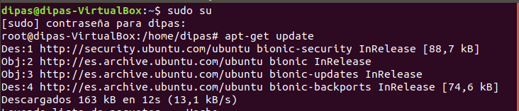

Una vez hecha dicha actualizacion instalamos el paquete mysql-server, que es el que nos permite trabajar con bases de datos. Instalamos aquellas dependencias que el Linux considere oportunas:

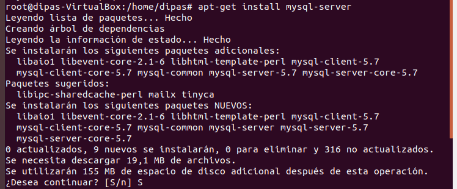

Con MYSQL-Server instalado, ya podemos empezar a trabajar. Para ello, ejecutamos MYSQL como usuario root, dandole la contraseña pertinente:

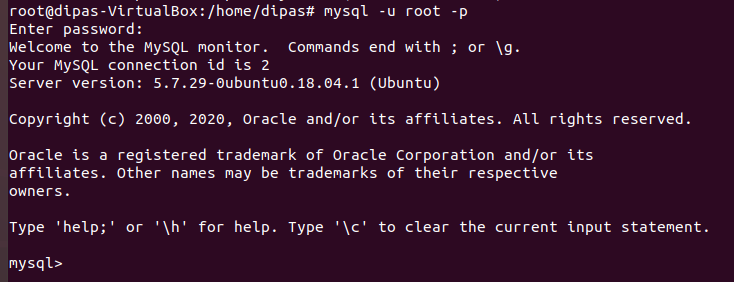

Ya entramos en el intérprete de comandos de MYSQL, hacemos pruebas creando una base de datos cualquiera:


Comprobamos las bases de datos existentes:


[Volver al Indice](#indice)

# Comandos MYSQL
Además de las instrucciones SQL vistas hasta ahora, destaco algunos comandos para utilizar MYSQL, mostrar estructura de la información y datos.

## Mostrar Bases de datos
Muestra todas las bases de datos disponibles en un momento dado. Estructura:

```sql
SHOW DATABASES;
```

[Volver al Indice](#indice)

## Usar Base de datos
Indica como activa una base de datos específica. De esta manera, MYSQL sabe sobre que base de datos ha de aplicar las operaciones que le indicamos. Estructura:

```sql
USE <Base_de_datos>;
```

[Volver al Indice](#indice)

## Mostrar tablas
Muestra todas las tablas de la base de datos activa. Estructura:

```sql
SHOW TABLES;
```

[Volver al Indice](#indice)


## Mostrar Información de Tabla
Muestra información de la tabla especificada, que está dentro de la BD activa. Estructura:

```sql
DESC <Nombre_Tabla>;
```

[Volver al Indice](#indice)

## Otros
Mas allá de los descritos anteriormente, para acceder a la información de cada tabla se siguen usando consultas de tipo SELECT. Igualmente instrucciones de tipo DDL o DML tales como CREATE, DELETE o UPDATE siguen siendo válidas, pero no las voy a volver a explicar en este apartado.

[Volver al Indice](#indice)

# Crear Bases de Datos en MYSQL

## Base de datos de Investigacion
Creamos la base de datos Investigación, con la siguiente estructura:

```sql
DROP SCHEMA IF EXISTS Proyectos_Investigacion;
 
CREATE SCHEMA Proyectos_Investigacion;

CREATE TABLE Proyectos_Investigacion.Sede (
	Nome_Sede VARCHAR(30) PRIMARY KEY,
	Campus VARCHAR(30) NOT NULL
);

CREATE TABLE Proyectos_Investigacion.Programa(
	Nome_Programa VARCHAR(30) PRIMARY KEY
);

CREATE TABLE Proyectos_Investigacion.Proxecto(
	Codigo_Proxecto INTEGER PRIMARY KEY,
	Nome_Proxecto VARCHAR(30) UNIQUE NOT NULL,
	Orzamento DECIMAL NOT NULL,
	Data_Inicio DATE NOT NULL,
	Data_Fin DATE,
	Nome_Grupo VARCHAR(30),
	Nome_Departamento VARCHAR(30),
	CHECK (Data_Inicio<Data_Fin),
	CHECK (Codigo_Proxecto>0)
);


CREATE TABLE Proyectos_Investigacion.Profesor(
	Dni CHAR(9) PRIMARY KEY,
	Nome_Profesor VARCHAR(30) NOT NULL,
	Titulacion VARCHAR(30) NOT NULL,
	Experiencia INTEGER,
	Nome_Grupo VARCHAR(30),
	Nome_Departamento VARCHAR(30),
	CHECK (LENGTH(Dni)=9)
);

CREATE TABLE Proyectos_Investigacion.Grupo(
	Nome_Grupo VARCHAR(30),
	Nome_Departamento VARCHAR(30),
	Area VARCHAR(30) NOT NULL,
	Lider CHAR(9),
	PRIMARY KEY (Nome_Grupo, Nome_Departamento)
);

CREATE TABLE Proyectos_Investigacion.Departamento(
	Nome_Departamento VARCHAR(30) PRIMARY KEY,
	Telefono INTEGER NOT NULL,
	Director CHAR(9)
);

CREATE TABLE Proyectos_Investigacion.Ubicacion(
 	Nome_Sede VARCHAR(30),
	Nome_Departamento VARCHAR(30),
	PRIMARY KEY(Nome_Sede, Nome_Departamento)
	
);

CREATE TABLE Proyectos_Investigacion.Participa(
	Dni CHAR(9),
	Codigo_Proxecto INTEGER,
	Data_Inicio DATE NOT NULL,
	Data_Cese DATE,
	Participacion VARCHAR(30),
	PRIMARY KEY (Dni, Codigo_Proxecto),
	CHECK(Data_Cese IS NULL OR (Data_Cese IS NOT NULL AND Data_Cese>Data_Inicio)) 
);

CREATE TABLE Proyectos_Investigacion.Financia(
	Nome_Programa VARCHAR(30),
	Codigo_Proxecto INTEGER,
	Numero_Proxecto INTEGER NOT NULL,
	Cantidade_Financiada DECIMAL NOT NULL,
	PRIMARY KEY (Nome_Programa, Codigo_Proxecto)
);

ALTER TABLE Proyectos_Investigacion.Proxecto ADD FOREIGN KEY (Nome_Grupo, Nome_Departamento)
REFERENCES Proyectos_Investigacion.Grupo (Nome_Grupo, Nome_Departamento) ON DELETE SET NULL ON UPDATE CASCADE;

ALTER TABLE Proyectos_Investigacion.Profesor ADD FOREIGN KEY (Nome_Grupo, Nome_Departamento)
REFERENCES Proyectos_Investigacion.Grupo (Nome_Grupo, Nome_Departamento) ON DELETE SET NULL ON UPDATE CASCADE;

ALTER TABLE Proyectos_Investigacion.Grupo ADD FOREIGN KEY (Lider)
REFERENCES Proyectos_Investigacion.Profesor (Dni) ON DELETE SET NULL ON UPDATE CASCADE;

ALTER TABLE Proyectos_Investigacion.Grupo ADD FOREIGN KEY (Nome_Departamento)
REFERENCES Proyectos_Investigacion.Departamento (Nome_Departamento) ON DELETE CASCADE ON UPDATE CASCADE;

ALTER TABLE Proyectos_Investigacion.Participa ADD FOREIGN KEY (Codigo_Proxecto)
REFERENCES Proyectos_Investigacion.Proxecto (Codigo_Proxecto) ON UPDATE CASCADE;

ALTER TABLE Proyectos_Investigacion.Participa ADD FOREIGN KEY (Dni)
REFERENCES Proyectos_Investigacion.Profesor (Dni) ON UPDATE CASCADE;

ALTER TABLE Proyectos_Investigacion.Financia ADD FOREIGN KEY (Nome_Programa)
REFERENCES Proyectos_Investigacion.Programa (Nome_Programa) ON UPDATE CASCADE ON DELETE CASCADE;

ALTER TABLE Proyectos_Investigacion.Financia ADD FOREIGN KEY (Codigo_Proxecto)
REFERENCES Proyectos_Investigacion.Proxecto (Codigo_Proxecto) ON DELETE CASCADE ON UPDATE CASCADE;

ALTER TABLE Proyectos_Investigacion.Ubicacion ADD FOREIGN KEY (Nome_Sede)
REFERENCES Proyectos_Investigacion.Sede (Nome_Sede) ON DELETE CASCADE ON UPDATE CASCADE;

ALTER TABLE Proyectos_Investigacion.Ubicacion ADD FOREIGN KEY (Nome_Departamento)
REFERENCES Proyectos_Investigacion.Departamento (Nome_Departamento) ON DELETE CASCADE ON UPDATE CASCADE;

ALTER TABLE Proyectos_Investigacion.Departamento ADD FOREIGN KEY (Director)
REFERENCES Proyectos_Investigacion.Profesor (Dni) ON DELETE SET NULL ON UPDATE CASCADE;
```

Comprobamos que nuestra base de datos esta entre las existentes en nuestro servidor con el comando `SHOW DATABASES`:


Pasamos a usar dicha base de datos con el comando `USE <NombreBD>`:


Comprobamos las tablas de la base de datos `SHOW TABLES`:


El comando `DESC` nos permite obtener una descripción detallada de cada base de datos:

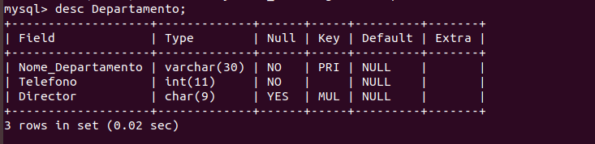

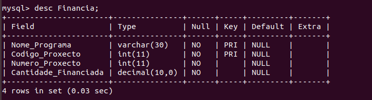

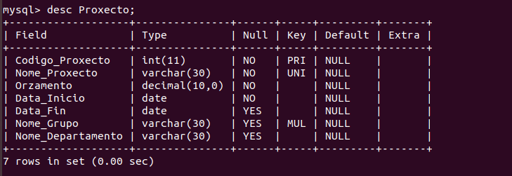

[Volver al Indice](#indice)

## Base de datos de Naves Espaciales
El script para crear la base de datos de Naves Espaciales, con todas sus tablas relacionadas será el siguiente:

```sql
DROP SCHEMA IF EXISTS Naves_Espaciais;
 
CREATE SCHEMA Naves_Espaciais;

CREATE TABLE Naves_Espaciais.Servizo(
	Clave_Servizo CHAR(9),
	Nome_Servizo VARCHAR(30),
	PRIMARY KEY(Clave_Servizo, Nome_Servizo),
	CHECK(LENGTH(Clave_Servizo)=9)	
);

CREATE TABLE Naves_Espaciais.Dependencia(
	Codigo_Dependencia INTEGER PRIMARY KEY AUTO_INCREMENT,
	Nome_Dependencia VARCHAR(30) NOT NULL UNIQUE,
	Clave_Servizo CHAR(9) NOT NULL,
	Nome_Servizo VARCHAR(30) NOT NULL,
	Funcion VARCHAR(30),
	Localizacion VARCHAR(30),
	FOREIGN KEY(Clave_Servizo, Nome_Servizo) REFERENCES Naves_Espaciais.Servizo(Clave_Servizo, Nome_Servizo)
	ON UPDATE CASCADE
	ON DELETE CASCADE
);

CREATE TABLE Naves_Espaciais.Camara(
	Codigo_Dependencia INTEGER PRIMARY KEY,
	Categoria VARCHAR(30) NOT NULL,
	Capacidade INTEGER NOT NULL,
	CHECK(Capacidade > 0),
	FOREIGN KEY(Codigo_Dependencia) REFERENCES Naves_Espaciais.Dependencia(Codigo_Dependencia)
	ON DELETE CASCADE
	ON UPDATE CASCADE
);

CREATE TABLE Naves_Espaciais.Raza(
	Nome_Raza VARCHAR(30) PRIMARY KEY,
	Altura DECIMAL NOT NULL,
	Anchura DECIMAL  NOT NULL,
	Peso DECIMAL NOT NULL,
	Poboacion_Total BIGINT NOT NULL,
	CHECK(Altura > 0 AND Anchura > 0 AND Peso > 0 AND Poboacion_Total >= 0)
);

CREATE TABLE Naves_Espaciais.Planeta(
	Codigo_Planeta INTEGER PRIMARY KEY AUTO_INCREMENT,
	Nome_Planeta VARCHAR(30) UNIQUE NOT NULL,
	Galaxia VARCHAR(30) NOT NULL,
	Coordenadas VARCHAR(15) UNIQUE NOT NULL
);

CREATE TABLE Naves_Espaciais.Habita(
	Codigo_Planeta INTEGER,
	Nome_Raza VARCHAR(30),
	Poboacion_Parcial BIGINT NOT NULL,
	CHECK (Poboacion_Parcial>=0),
	PRIMARY KEY(Codigo_Planeta, Nome_Raza),
	FOREIGN KEY(Codigo_Planeta) REFERENCES Naves_Espaciais.Planeta(Codigo_Planeta)
	ON UPDATE CASCADE ON DELETE CASCADE,
	FOREIGN KEY(Nome_Raza) REFERENCES Naves_Espaciais.Raza(Nome_Raza)
	ON UPDATE CASCADE ON DELETE CASCADE
);

CREATE TABLE Naves_Espaciais.Tripulacion(
	Codigo_Tripulacion INTEGER PRIMARY KEY AUTO_INCREMENT,
	Nome_Tripulacion VARCHAR(30) NOT NULL,
	Codigo_Camara INTEGER NOT NULL,
	Codigo_Dependencia INTEGER NOT NULL,
	Categoria VARCHAR(30) NOT NULL,
	Antiguedade INTEGER NOT NULL,
	Procedencia VARCHAR(30) NOT NULL,
	Administracion VARCHAR(30) NOT NULL,
	CHECK(Antiguedade>=0),
	CHECK(Administracion='En servicio' OR Administracion='De baja'),
	FOREIGN KEY(Codigo_Camara) REFERENCES Naves_Espaciais.Camara(Codigo_Dependencia)
	ON UPDATE CASCADE ON DELETE CASCADE,
	FOREIGN KEY(Codigo_Dependencia) REFERENCES Naves_Espaciais.Dependencia(Codigo_Dependencia)
	ON UPDATE CASCADE ON DELETE CASCADE
);

CREATE TABLE Naves_Espaciais.Visita(
	Codigo_Tripulacion INTEGER,
	Codigo_Planeta INTEGER,
	Data_Visita DATE,
	Tempo INTEGER NOT NULL,
	CHECK(Tempo>=0),
	PRIMARY KEY(Codigo_Tripulacion,Codigo_Planeta,Data_Visita),
	FOREIGN KEY(Codigo_Tripulacion) REFERENCES Naves_Espaciais.Tripulacion(Codigo_Tripulacion)
	ON UPDATE CASCADE ON DELETE CASCADE,
	FOREIGN KEY(Codigo_Planeta) REFERENCES Naves_Espaciais.Planeta(Codigo_Planeta)
	ON UPDATE CASCADE ON DELETE CASCADE
);
```

Para esta base de datos vamos a importar un archivo sql. Para ello creamos uno con el editor `NANO`:


Añadimos el script de creación de la base de datos antes detallado:

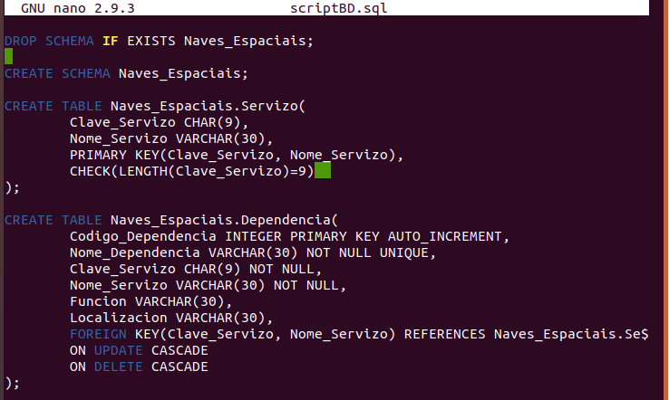

Ahora con `mysql` importamos el script:

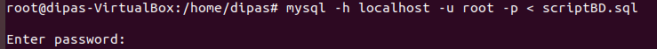

Comprobamos que se han creado las tablas con `SHOW TABLES`:

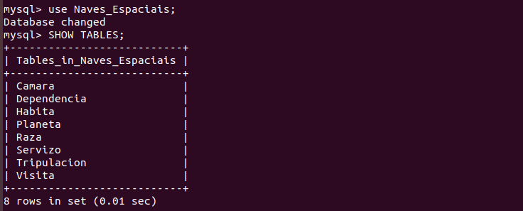

Vemos información de cada tabla con el comando `DESC`:
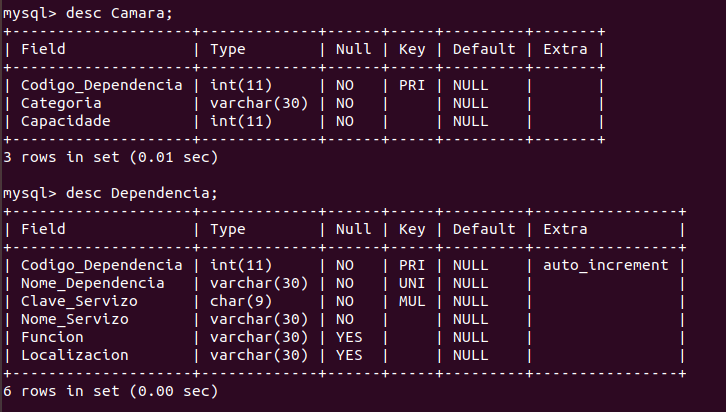

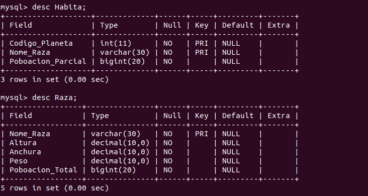

[Volver al Indice](#indice)
